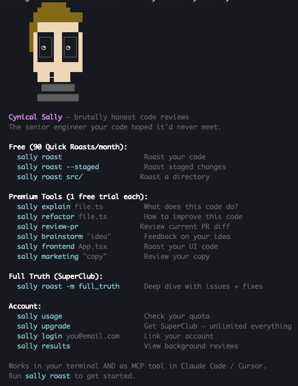
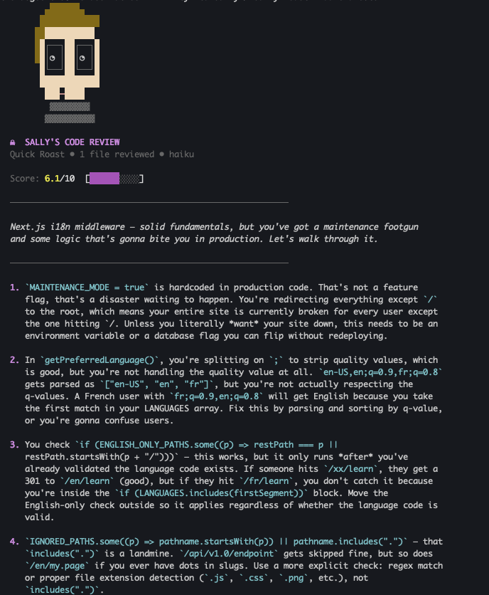
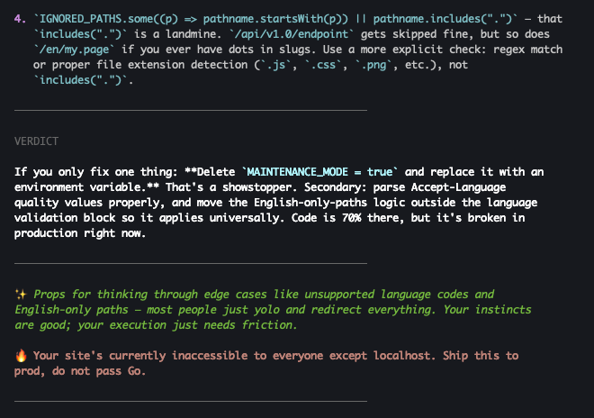

<p align="center">
  
</p>

<h1 align="center">@cynicalsally/cli</h1>

<p align="center">
  <strong>Brutally honest code reviews. Terminal + IDE.</strong><br/>
  <em>Because "You're absolutely right" is probably absolutely wrong.</em>
</p>

<p align="center">
  <a href="https://www.npmjs.com/package/@cynicalsally/cli"></a>
  <!-- <a href="https://www.npmjs.com/package/@cynicalsally/cli"></a> -->
  <a href="https://github.com/w1ckedxt/cynicalsally-cli/blob/main/LICENSE"></a>
</p>

---

Your AI pair programmer is lying to you. Sally isn't.

She's the senior engineer your code hoped it'd never meet. Scores from 0 to 10, real issues backed by evidence, and fixes you can actually use.

Works as a CLI tool and as an MCP server in [Claude Code](https://claude.ai/claude-code), [Cursor](https://cursor.com), and [Windsurf](https://windsurf.com).

<p align="center">
  
</p>
<p align="center">
  
  
</p>

## Install

```bash
npm install -g @cynicalsally/cli
```

Or run without installing:

```bash
npx @cynicalsally/cli roast ./src/
```

**Requirements:** Node.js 18+

## Quick Start

```bash
# Sally auto-detects what to review
sally roast
# → staged changes? reviews those
# → unstaged changes? reviews those
# → recent commit? reviews that
# → nothing? scans the directory

# Roast a file or directory
sally roast src/utils/auth.ts
sally roast ./src/

# Roast staged changes before you commit
sally roast --staged

# Compare your branch against main
sally roast --diff main

# Deep analysis with issues + actionable fixes
sally roast ./src/ -m full_truth

# Run deep analysis in the background (OS notification when done)
sally roast ./src/ -m full_truth --bg
```

## Roast Options

```
sally roast [paths...] [options]

  --staged              Review only staged git changes
  --diff <branch>       Compare against another branch (e.g., main)
  -m, --mode <mode>     "quick" (default) or "full_truth" (deep dive)
  --tone <tone>         "cynical" (default), "neutral", or "professional"
  --lang <lang>         Response language code (default: "en")
  --json                Output raw JSON (for piping or scripting)
  --fail-under <score>  Exit code 1 if quality score is below threshold
  --ci                  CI mode: compact output, exit codes
  --bg                  Run Full Truth in background, get OS notification when done
```

---

<h2 align="center">Sally's Full Suite</h2>

<p align="center">
  <em>6 CLI tools. Unlimited usage. The most honest code reviewer you'll ever work with, right in your terminal.</em>
</p>

<p align="center">
  
</p>

---

### Explain


Sally reads the spaghetti someone left in your codebase and translates it into plain English. Just the cold, clear truth of what it actually does.

```bash
sally explain src/utils/auth.ts

# Pipe code directly
cat legacy-module.js | sally explain

# Explain the current directory
sally explain
```

<br clear="right"/>

---

### Refactor


Before and after, side by side. Sally explains why one of them is going to haunt your 3am on-call rotation.

```bash
sally refactor src/components/Dashboard.tsx

# Refactor current directory
sally refactor
```

<br clear="right"/>

---

### PR Review


Sally reviews your PR like a senior engineer who has time, opinions, and absolutely no reason to be polite.

```bash
# Review PR #42 (requires GitHub CLI)
sally review-pr 42

# Review current branch vs main
sally review-pr

# Pipe a diff
git diff main | sally review-pr
```

<br clear="right"/>

---

### Brainstorm


Pitch your architecture idea and Sally tells you the three ways it falls apart at scale. Cheaper than a post-mortem.

```bash
sally brainstorm "Microservices for a 2-person team?"

# Brainstorm about the current project
sally brainstorm
```

<br clear="right"/>

---

### Frontend Review


Sally tells you why your component re-renders on every keystroke and why your z-index is load-bearing.

```bash
sally frontend src/components/Header.tsx

# Review all frontend code in a directory
sally frontend ./src/
```

<br clear="right"/>

---

### Marketing Review


Run your copy by Sally before your customers do. They won't be this constructive about it.

```bash
sally marketing "Ship faster with AI-powered code reviews"

# Review your README and landing page copy
sally marketing README.md
```

<br clear="right"/>

---

Every tool accepts **file paths**, **raw text**, or **piped stdin**. Each includes **1 free trial**, no account needed.

## CI/CD Integration

Gate your pipeline on code quality:

```yaml
# GitHub Actions
- name: Sally Code Review
  run: npx @cynicalsally/cli roast ./src/ --fail-under=5 --ci
```

`--ci` gives compact output with exit codes. `--fail-under` fails the build when the score drops below your threshold. Add `--json` for machine-readable output.

## MCP Server

Sally works as an MCP server inside **Claude Code**, **Cursor**, and **Windsurf**.

### Claude Code

```bash
claude mcp add cynical-sally -- npx @cynicalsally/cli mcp
```

### Cursor

Add to `~/.cursor/mcp.json` (global) or `.cursor/mcp.json` (per project):

```json
{
  "mcpServers": {
    "cynical-sally": {
      "command": "npx",
      "args": ["@cynicalsally/cli", "mcp"]
    }
  }
}
```

### Windsurf

Add to `~/.codeium/windsurf/mcp_config.json`:

```json
{
  "mcpServers": {
    "cynical-sally": {
      "command": "npx",
      "args": ["@cynicalsally/cli", "mcp"]
    }
  }
}
```

### Available tools

| MCP Tool | What it does |
|----------|-------------|
| `sally_roast` | Code review with score, issues, and fixes |
| `sally_explain` | Explain code with Sally's personality |
| `sally_review_pr` | Review PR diffs |
| `sally_refactor` | Refactoring suggestions with before/after |
| `sally_brainstorm` | Feedback on ideas and approaches |
| `sally_frontend` | Frontend/UI code review |
| `sally_marketing` | Marketing copy review |
| `sally_usage` | Check quota and account status |

Run `sally mcp` in your terminal to see setup instructions.

## All Commands

| Command | Description |
|---------|-------------|
| `sally roast [paths...]` | Review files, directories, or git changes |
| `sally explain [file]` | Explain what code actually does |
| `sally refactor [file]` | Refactoring with before/after code |
| `sally review-pr [pr]` | Review a PR diff |
| `sally brainstorm "idea"` | Feedback on ideas and approaches |
| `sally frontend [file]` | Frontend/UI code review |
| `sally marketing "copy"` | Marketing copy review |
| `sally login <email>` | Log in via magic link |
| `sally logout` | Clear stored session |
| `sally usage` | Check your quota and account status |
| `sally upgrade` | Upgrade to Sally's Full Suite |
| `sally results` | View background review results |
| `sally mcp` | MCP server setup instructions |

## Free to Use

90 free roasts per month, no account needed. Every premium tool includes a free trial.

```bash
sally usage     # Check your quota
sally upgrade   # Unlock the Full Suite
```

## Privacy & Security

- Code is transmitted over HTTPS and processed in real-time
- **No source code is stored** on our servers. Ever.
- Analysis results are tied to an anonymous device ID
- Full Suite members can optionally link an email for account features
- Config stored locally at `~/.sally/config.json`

For full details: [cynicalsally.com/privacy](https://cynicalsally.com/privacy)

## Contributing

Found a bug or have a feature idea? [Open an issue](https://github.com/w1ckedxt/cynicalsally-cli/issues). Sally promises to only judge your issue title a little.

## License

[MIT](LICENSE)

---

<p align="center">
  <a href="https://cynicalsally.com">cynicalsally.com</a> · <a href="https://www.npmjs.com/package/@cynicalsally/cli">npm</a> · <a href="https://github.com/w1ckedxt/cynicalsally-cli/issues">issues</a>
</p>
